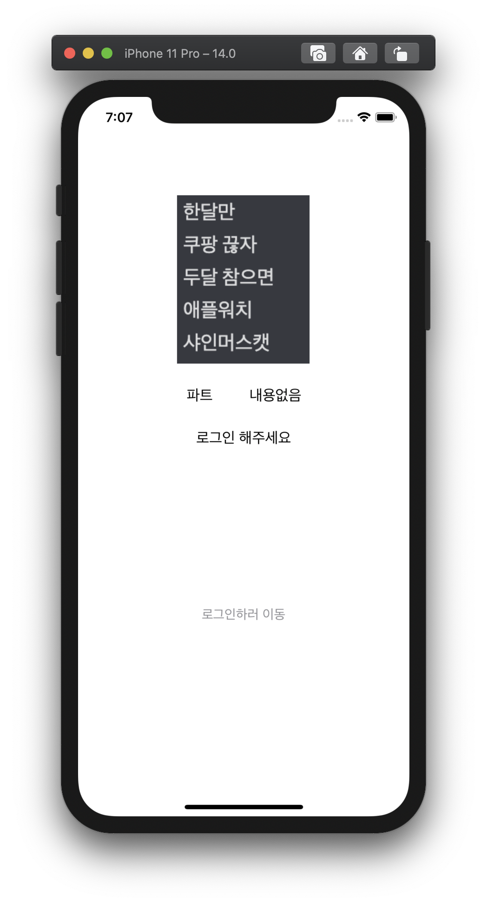
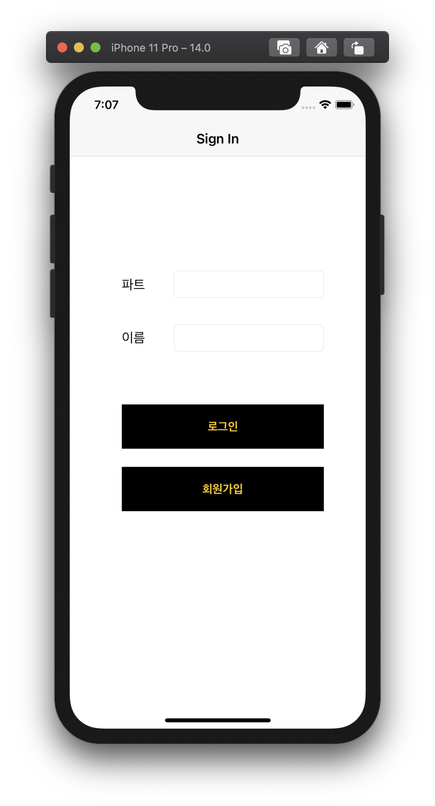
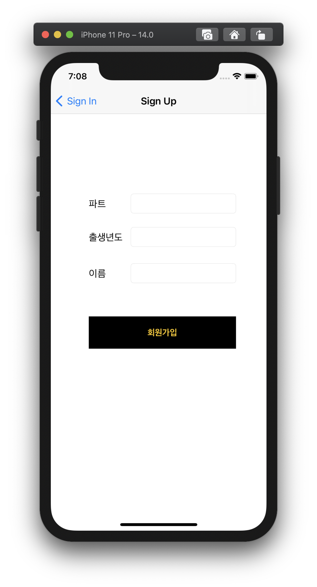
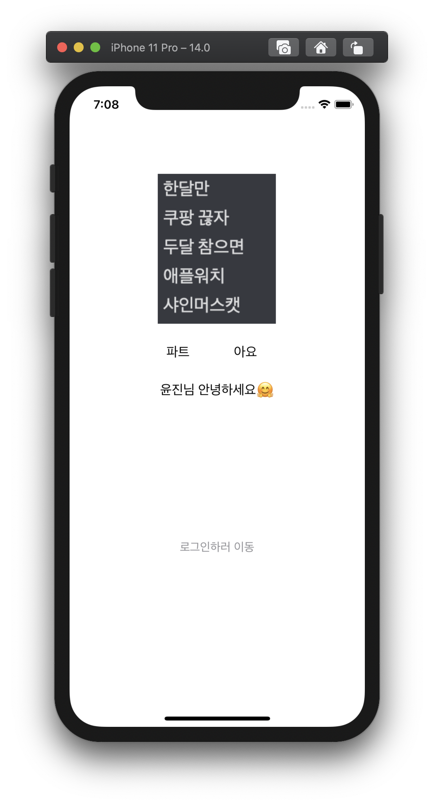

# LeeYoonJin
🍏 이윤진

🍎 아요 과제 레포

---------

**1️⃣주차 과제**

  

* push, present, dismiss 뷰 전환 실습

* (도전과제) AppDelegate 활용하여 데이터 다른 뷰에 전달하기

  > AppDelegate 파일에 변수 선언

  ```swift
  class AppDelegate: UIResponder, UIApplicationDelegate {
    
      var partName: String?
      var memberName: String?
  ```

  > SignInVC(로그인)내의 로그인 버튼 Action 함수 내부

  ```swift
    @IBAction func loginBtnTouched(_ sender: Any) {
          
          let ad = UIApplication.shared.delegate as? AppDelegate
          ad?.partName = self.partTextField.text
          ad?.memberName = "\(self.nameTextField.text ?? "")님 안녕하세요🤗"
          
          self.dismiss(animated: true, completion: nil)
      }
  ```

  👉 텍스트필드에 입력한 내용 전달해주기

  > 메인VC의 viewWillAppear함수

  ```swift
  override func viewWillAppear(_ animated: Bool) {
          let ad = UIApplication.shared.delegate as? AppDelegate
          if let part = ad?.partName{
              partLabel.text = part
          }
          if let name = ad?.memberName{
              introLabel.text = name
          }
      }
  ```

  👉 viewDidLoad()는 1회 호출, 화면에 나타나기 직전에 상태 업데이트 해주는 viewWillAppear() 사용

